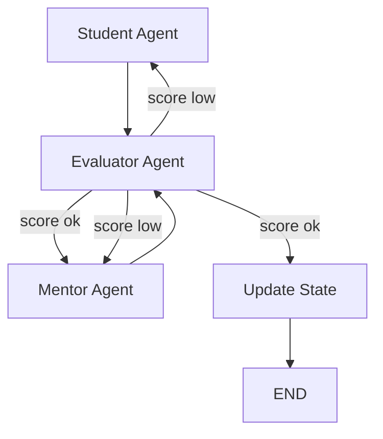

# Insight Chain

**Insight Chain** is a multi-agent conversational system designed to simulate a dialogue between a curious student and an expert mentor while analyzing academic documents. It incrementally builds understanding through question-answer refinement, memory accumulation, and automated evaluation — with minimal human intervention.

## 🔍 What It Does

- Parses a technical document (Markdown `.md`) into sections.
- Simulates a student agent that generates insightful questions.
- Simulates a mentor agent that answers clearly and accurately.
- Evaluates the quality of the Q&A using a third agent.
- Decides whether to continue, retry, or finalize the dialogue based on score.
- Maintains memory across turns to ensure coherent progression.
- Designed to help users deeply understand technical content, step by step.

## 🧠 System Architecture

This system uses a **graph-based execution model** (powered by `LangGraph`) where each agent is a node in the flow:



- `Student Agent`: Generates questions from context + memory.
- `Mentor Agent`: Answers based on the current section and previous dialogue.
- `Evaluator Agent`: Judges quality using rules or LLM-as-a-Judge.
- `State Node`: Updates memory and progresses to next section if valid.

## 🗂️ Project Structure

```
multiagent-system/
│
├── agents/             # Core agent logic (student, mentor, evaluator)
├── constants/          # Constants for labels, thresholds
├── graph/              # Graph construction with LangGraph
├── nodes/              # Node functions and routing
├── state/              # Dialogue state tracking (memory, turns, etc.)
├── utils/              # Parser and helpers
├── papers/             # Sample markdown documents to analyze
└── main.py             # CLI entry point
```

## 🚀 Getting Started

### 1. Clone the repo

```bash
git clone git@github.com:TEFI/insight_chain.git
cd insight_chain
```

### 2. Install dependencies

```bash
pip install -r requirements.txt
```

### 3. Run the system

```bash
python main.py --doc papers/document_name.md
```

### (Optional) Customize agent logic

Modify the agents under `agents/` to change how questions, answers, and evaluations are generated. You can plug in OpenAI, Gemini, Claude, or local models like Mistral.

## 🧩 Built With

- [LangGraph](https://github.com/langchain-ai/langgraph)
- [evopromptfx](https://github.com/evopromptfx)
- [Pydantic](https://github.com/pydantic/pydantic)
- [Transformers](https://github.com/huggingface/transformers)
- [Google Generative AI](https://ai.google.dev/)

## 📄 License

MIT License © 2025 [TEFI](https://github.com/TEFI)
